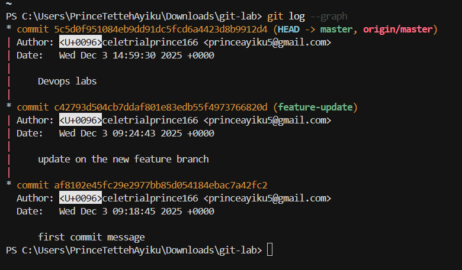

# Git Repository Management Lab - Lab Report

## Student Information
**Name:** [Prince Tetteh Ayiku]  

---

## Learning Objective
Apply fundamental Git and GitHub commands to manage source code (Bloom's Level: Apply)

---

## Overview
This lab provided hands-on experience with fundamental Git and GitHub commands for managing source code. I learned to initialize repositories, create commits, work with branches, merge changes, and push work to GitHub. This documentation reflects my completion of all lab tasks and demonstrates my understanding of version control workflows.

---


## Task 3: Create Your First Commit

### Step 1 — Create a File
I created a readme file with initial content:
```bash
echo "Hello Git!" > readme.txt
```

### Step 2 — Check File Status
I checked the repository status:
```bash
git status
```

The output showed that `readme.txt` was an untracked file.

### Step 3 — Add File to Staging
I staged the file for commit:
```bash
git add readme.txt
```

### Step 4 — Commit
I created my first commit:
```bash
git commit -m "Initial commit: Added readme file"
```

**Result:** My first commit was successfully created. The commit was stored in the repository history with a unique hash ID. This demonstrated the basic workflow of staging and committing changes.

---

## Task 4: Create and Work on a Branch

### Step 1 — Create a Branch
I created a new branch called `feature-update`:
```bash
git branch feature-update
```

### Step 2 — Switch to Branch
I switched to the new branch:
```bash
git checkout feature-update
```

### Step 3 — Edit File
I added new content to the readme file:
```bash
echo "New feature added!" >> readme.txt
```

### Step 4 — Stage and Commit
I staged and committed the changes:
```bash
git add readme.txt
git commit -m "Updated readme with new feature text"
```

**Result:** I successfully created a feature branch and made changes that existed only in that branch. The main branch remained unchanged, demonstrating how branches allow for isolated development work.

---

## Task 5: Merge the Branch Back to Main

### Step 1 — Switch to Main
I switched back to the main branch:
```bash
git checkout main
```

### Step 2 — Merge
I merged the feature branch into main:
```bash
git merge feature-update
```

**Result:** The merge was successful. Git merged all changes from `feature-update` into `main`. The `readme.txt` file now contains both lines:
- "Hello Git!"
- "New feature added!"

This demonstrated how to integrate work from feature branches back into the main codebase.



---

## Task 6: Connect to GitHub

### Step 1 — Create GitHub Repository
I created a new repository on GitHub:
- Navigated to: https://github.com/new
- Named the repository: **git-lab**
- Created the repository without initializing with README, .gitignore, or license

### Step 2 — Add GitHub as Remote
I added GitHub as a remote repository:
```bash
git remote add origin https://github.com/<username>/git-lab.git
```

I verified the remote was added:
```bash
git remote -v
```

### Step 3 — Push Content
I pushed my local repository to GitHub:
```bash
git push -u origin main
```

**Result:** All my local commits and files were successfully pushed to GitHub. I verified by visiting my repository URL that all files and commit history are visible on GitHub.


---

## Task 7: View Commit History

### Step 1 — View History
I viewed the commit history with a graphical representation:
```bash
git log --oneline --graph
```

**Result:** The output displayed a clear tree structure showing:
- The main branch commits
- The feature branch that was created
- The merge point where the feature branch was merged into main

I could see at least two commits with their hash IDs and commit messages, demonstrating the branching and merging workflow visually.

---

## End-of-Lab Deliverables Checklist

By the end of this lab, I have successfully completed:

- [x] A local Git repository initialized
- [x] At least **two commits** in my repository history
- [x] A **feature branch** created and merged into main
- [x] A GitHub repository with all changes pushed
- [x] Understanding of staging, committing, branching, merging, and pushing

---

## Key Concepts Learned

Throughout this lab, I gained hands-on experience with:

1. **Git Configuration** - Setting up Git with personal identity (username and email)
2. **Repository Initialization** - Creating a new Git repository with `git init`
3. **Staging and Committing** - Using `git add` to stage files and `git commit` to save changes
4. **Branching** - Creating isolated work environments with `git branch` and `git checkout`
5. **Merging** - Combining branches using `git merge`
6. **Remote Repositories** - Connecting local repositories to GitHub and pushing changes
7. **Version History** - Viewing commit history with `git log`

---

## Challenges and Solutions

During the lab, I encountered the following:

**Challenge 1:** Initial push to GitHub required authentication setup.  
**Solution:** I set up proper authentication using GitHub credentials or personal access tokens.

**Challenge 2:** Understanding the difference between staging and committing.  
**Solution:** I learned that staging (`git add`) prepares changes, while committing (`git commit`) permanently saves them to the repository history.

---

## Reflection

This lab provided valuable hands-on experience with Git version control. I now understand:
- How to track changes in my code using commits
- How to work on features in isolated branches without affecting the main codebase
- How to collaborate by pushing work to remote repositories like GitHub
- The importance of meaningful commit messages for tracking project history

The workflow of staging → committing → branching → merging → pushing is now clear, and I feel confident using these commands in future projects.

---

## Screenshots

The following screenshots document key steps of this lab:


---

**Lab Completion Date:** [10/12/2025]  
